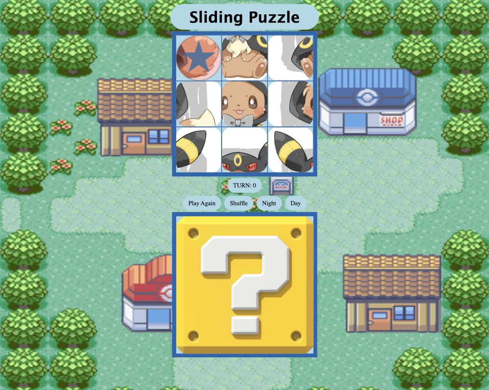
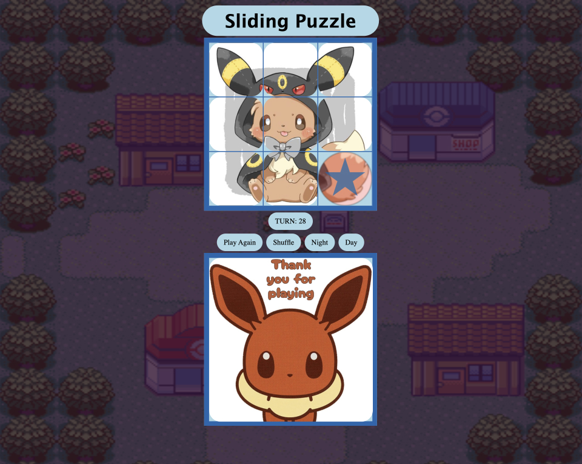

## Sliding Puzzle

Use Html CSS and JavaScript to create Sliding Puzzle Game

## :page_facing_up: Project Description

This project base on JavaScript Document Object Model (DOM)

## :computer: [Click here](#) to see my live project!

## :pencil2: Planning Wireflame

## :rocket: In Game Screenshot

Day theme:

Night theme:

### ⚙️ Technologies Used

-   HTML
-   CSS
-   JavaScript
-   DOM Manipulation
-   Figma

### 🚀 Next Steps

Features that can be added in future:

-   Use JavaScript object oriented programming
-   Add more stages and image to pick
-   User can choose there own image to play
-   Add 4\*4 Board

## Credit

Image:
https://www.pinterest.com/pin/827114287827310864/visual-search/?x=16&y=16&w=532&h=532&cropSource=6&imageSignature=dcd6e206eda1d9480e3ce4ab0397552a
